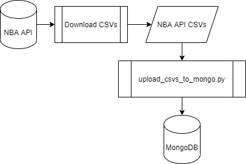

# NBA Data in MongoDB

## Overview

<b>NBA Data in MongoDB</b> creates a MongoDB database to house our own local copy of the publicly available NBA API. Here's a quick overview:
* <b>MongoDB</b> and <b>mongo-express</b> maintained within Docker containers
* Python scripts upload CSVs to MongoDB

<b>Why?</b> With our own copy of the data, we can slice and dice it in any way we want. From there, we can build interesting ML models!

## Quickstart

	python upload_csvs_to_mongo.py

## Process Diagram

## Requirements

1. Operating System 
This code has only been tested on Ubuntu 20.04.1 LTS.
2. Infrastructure 
Python 3.8.0
3. Knowledge 
* MongoDB
* pymongo
* NBA API
* docker

## Resources

* Great Unofficial Documenation of NBA API 
[https://github.com/bradleyfay/py-Goldsberry](https://github.com/bradleyfay/py-Goldsberry)
* mongo-express: MongoDB admin interface 
[https://hub.docker.com/_/mongo-express](https://hub.docker.com/_/mongo-express)